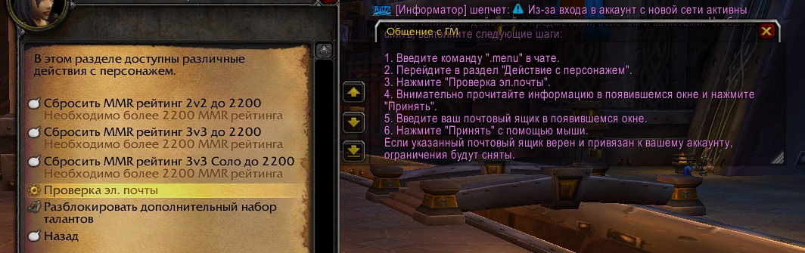
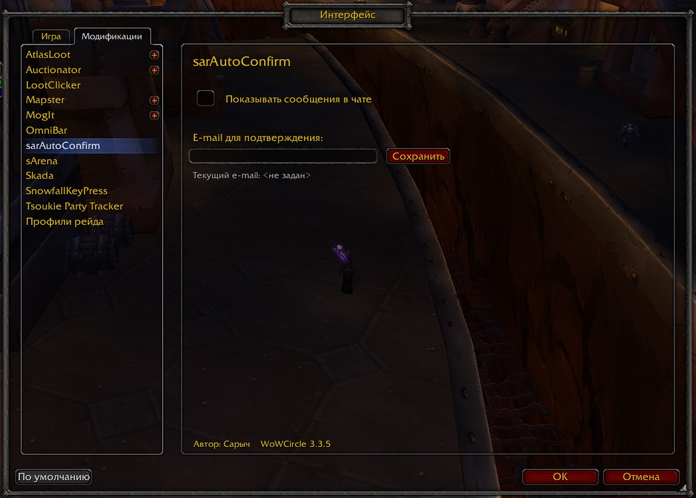

# sarAutoConfirm

Автоматическое подтверждение e-mail при смене подсети на серверах **WoWCircle 3.3.5**.



## Описание

Аддон избавляет от необходимости вручную подтверждать e-mail каждый раз при смене IP. Особенно полезен при использовании VPN, мобильного интернета или нестабильного подключения. После однократного ввода e-mail подтверждение выполняется автоматически.

Срабатывает либо при системном сообщении при входе в игру, либо при попытке удалить предмет, если триггер активирован.  
```
Работает на весь аккаунт — вводить e-mail на каждом персонаже не требуется.
```
## Возможности

- Автоматическое определение смены подсети  
- Полный автоответ на подтверждение  
- Возможность отключить чат-уведомления (о этапах работы аддона)

## Установка

1. Скачайте последний релиз
   
2. Поместите папку `sarAutoConfirm` в:
   ```
   World of Warcraft/Interface/AddOns/
   ```
3. Перезапустите игру

## Настройка

- В игре откройте:  
  ```
  Escape → Интерфейс → Модификации → sarAutoConfirm
  ```
- Введите e-mail  
- При необходимости отключите чат-сообщения (о этапах работы аддона)



## Структура аддона

```
sarAutoConfirm/
├── sarAutoConfirm.toc
├── sarAutoConfirm.lua
└── sarAutoConfirmOptions.lua
```
